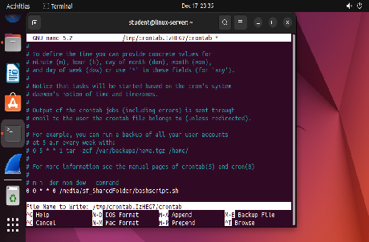

# Log Monitoring Workflow

## Violet Figueroa

[Introduction](#introduction)

[Solutions](#solutions)

[Potential Iterations](#potential-iterations)

[Conclusion](#conclusion)

[References and Citation](#references-and-citation)

[Appendix](#appendix)

## Introduction {#introduction}

My name is Violet Figueroa, an Access Log Analyst at Turn a New Leaf. Using a combination of Python and Bash, I have successfully automated the monitoring and logs documentation of our Linux and Windows servers. My workflow currently prioritizes automating checking for failed login attempts, unauthorized access attempts and system errors.

## Solutions {#solutions}

The Log Monitoring Workflow automates monitoring and analyzing logs from the Windows and Linux machines. The workflow begins with gathering logs from both systems, including authentication logs, system logs, and application logs. These logs are transferred to a shared folder accessible by both machines for centralized processing.

**Figure 1:** The Crontab schedules the script to run each night on the Linux server.

The Python script processes these logs alongside exported Windows Event Viewer logs. Using regex patterns, the Python script identifies suspicious activities, such as specific error codes (e.g., 0x80070005 for "Access Denied" on Windows) or equivalent error messages on Linux (e.g., "Authentication failure").

If any anomalies are detected, the script sends an email alert to notify the manager. Additionally, the system generates a weekly report summarizing all detected issues and sends it via email. The goal is to detect unusual activities, such as failed login attempts or unauthorized access, and send alerts to the manager when such behavior is identified.

## Potential Iterations {#potential-iterations}

This code acts as a starting point for this workflow. As we identify more threats and threat actors, we can modify this workflow to specific vulnerabilities. I can also look at setting up another machine that acts as a central logging machine for the network.
We can also use powershell to automate the gathering of windows event logs instead of needing to manually import them using the windows Gui. Most importantly, this only serves as 1 of our potential security tools to reduce risk and protect our assets.

## Conclusion

This workflow represents a start of creating consistent, reliable tools for identifying any serious threats to our Windows and Linux Server. It ensures Confidentiality, Integrity, and Availability to our important network in compliance with government regulations and expectations.

## References and Citation {#references-and-citation}

Goyvaerts, J. (2024, July 2). Regular Expression Tutorial \- Learn How to Use Regular Expressions. Regular-Expressions.info. Retrieved December 17, 2024, from [https://www.regular-expressions.info/tutorial.html](https://www.regular-expressions.info/tutorial.html)

Microsoft. (2024, April 24). Review events and errors using Event Viewer \- Microsoft Defender for Endpoint. Microsoft Learn. Retrieved December 17, 2024, from [https://learn.microsoft.com/en-us/defender-endpoint/event-error-codes](https://learn.microsoft.com/en-us/defender-endpoint/event-error-codes)

Red Hat Inc. (2024). *Chapter 23\. Viewing and Managing Log Files | Red Hat Product Documentation*. Red Hat Documentation. Retrieved December 17, 2024, from [https://docs.redhat.com/en/documentation/red\_hat\_enterprise\_linux/7/html/system\_administrators\_guide/ch-viewing\_and\_managing\_log\_files](https://docs.redhat.com/en/documentation/red_hat_enterprise_linux/7/html/system_administrators_guide/ch-viewing_and_managing_log_files)

Python Software Foundation. (2024). *re — Regular expression operations — Python 3.13.1 documentation*. Python Docs. Retrieved December 17, 2024, from [https://docs.python.org/3/library/re.html](https://docs.python.org/3/library/re.html)

Python Software Foundation. (2024). *smtplib — SMTP protocol client — Python 3.13.1 documentation*. Python Docs. Retrieved December 17, 2024, from [https://docs.python.org/3/library/smtplib.html](https://docs.python.org/3/library/smtplib.html)

## Appendix {#appendix}

Code files included in Google Drive.

[image1]: /images/projects/log-monitoring-workflow/image1.png "Screenshot showing log monitoring workflow with system metrics and event tracking dashboard"
